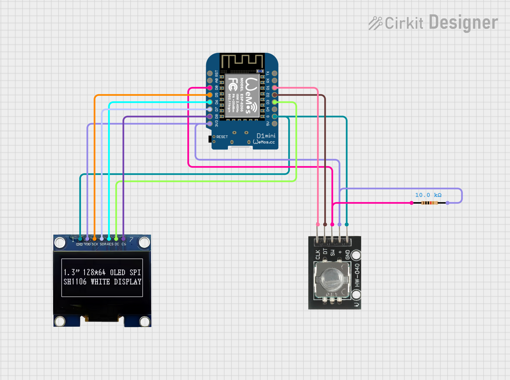

# Focus Timer

A customized version of [Project IGOR](https://github.com/UrbanCircles/igor), modified to suit my personal preferences and needs and the components I can easily find in major Indian hobby and electronics websites.

This is mostly the same as the original IGOR project, but with some tweaks to code and the PIN mapping for my specific hardware setup.

If you want to build your own version, you can use this as a starting point.

This would cut down the trial and error time for you, if your hardware is different from the original project and more close to mine.

## Features

Mostly same as the original IGOR project, with some minor tweaks, [see original](https://github.com/UrbanCircles/igor#its-simple-features-v1)

See this [video from the original project](https://www.youtube.com/watch?v=Wko0zgRGtPI) for a demo of the features.

## Hardware
- D1 Mini (ESP8266) - Sourced from robu.in
- 0.96" OLED Display (SSD1306)
- Rotary Encoder (HW-040)

## BOM

| Component | Quantity | Price (INR) | Robu.in Item and Link |
|-----------|----------|-------------|--------------|
| D1 Mini (ESP8266) | 1 | ₹ 182.00  | D1 Mini V2 NodeMcu 4M Bytes Lua WIFI Internet Of Things Development Board Based ESP8266 - [link](https://robu.in/product/d1-mini-v2-nodemcu-4m-bytes-lua-wifi-internet-of-things-development-board-based-esp8266/)     |
| 0.96" OLED Display (SSD1306) | 1 | ₹ 240.00 | 0.96″ OLED Display Module – SPI/I2C – 128×64 – 7 Pin (Blue) - [link](https://robu.in/product/0-96-oled-display-module/) |
| Rotary Encoder (HW-040) | 1 | ₹ 49.00 | M274 360 Degree Rotary Encoder Brick Sensor Module - [link](https://robu.in/product/m274-360-degree-rotary-encoder-module-brick-sensor/)  |
| Jumper Wires (Dupont) | 1 | ₹ 145.53 | 20 CM 40 Pin Dupont Cable Male/Male, Male/Female, Female/Female Cable Combo - [link](https://robu.in/product/20-cm-40-pin-dupont-male-male-male-female-female-female-cable-combo/)   |

Total BOM Cost: ₹ 616.53 INR

**Miscellaneous Items**

Breadboard, Jumper Wires(Dupont), 10k OHM resister, Soldering Station, etc.

## Pin Mapping and Wiring

The pin mapping is as follows:

#### OLED Pin Mapping

| OLED Pin | D1 Mini Pin | Comments                                                                 |
|----------|-------------|--------------------------------------------------------------------------|
| GND      | G (GND)     | Ground                                                                   |
| VDD      | 3V3         | Power supply (use 3.3V only)                                             |
| SCK      | D5          | SPI Clock — hardware SPI line, do not reuse                              |
| SDA      | D7          | SPI Data — hardware SPI line, do not reuse                               |
| RES      | D6          | OLD reset PIN                                                            |
| DC       | D3          | Has pull-up; LOW at boot can cause boot issues — OK with INPUT_PULLUP    |
| CS       | D8          | Must be LOW at boot — OLED CS is typically LOW anyway                    |

#### Rotary Encoder Pin Mapping

| Encoder Pin | D1 Mini Pin | Comments                                              |
|-------------|-------------|-------------------------------------------------------|
| CLK         | D1          | INT-capable — safe                                    |
| DT          | D2          | INT-capable — safe                                    |
| SW          | D0          | No internal pull-up — needs external 10KΩ pull-up     |

**NOTE**
- Don't use D4, it's connected to the onboard blue LED so leave D4 Pin unused to not interfere with the built in LED.
- Don’t use D7, D5 for anything other than SPI for OLED when using hardware SPI. this OLED breakout board uses hardware SPI, so you must use the same pins as shown above.

#### wiring diagram

See [Focus Timer Wiring](https://app.cirkitdesigner.com/project/0dea471c-eeaa-448d-815e-7a7b2d2015ea) cirkitdesigner project for interactive wiring diagram.

## Microcontroller firmware

Load the firmware from the focus_timer.ino file into your D1 Mini (ESP8266) using the Arduino IDE.

Watch this video to see how to setup Arduino IDE for ESP8266: [Get Started With A D1 Mini (ESP8266) In Under 5 Minutes!](https://www.youtube.com/watch?v=WnRk8w7SyTo)

If the firmware does not work as expected, or some components are not working, you can try to [debug_code](./debug_code/) firmware and try to debug with logs in the serial monitor in the Arduino IDE.

## 3D Printed Parts - Case

I used a [3D files](https://github.com/UrbanCircles/igor/tree/main/3D%20Parts) from the original project, and printed it on my printer.

Same file can be found on [Printables](https://www.printables.com/model/1019283-project-igor-open-source-offline-loyal-cheerful-fo)

If you don't own a 3D printer, ask your friends who have one or use 3D printing services from robu.in or other similar websites.

## Assembly & User Guide

See Original [Assembly](https://github.com/UrbanCircles/igor#assembly) and [guide](https://github.com/UrbanCircles/igor#user-guide)

## Credits

Most of the code is from [Project IGOR by UrbanCircles](https://github.com/UrbanCircles/igor) with some modifications by me.

The original project is licensed under the MIT License, my debugging code and modifications are also licensed under the MIT License.
